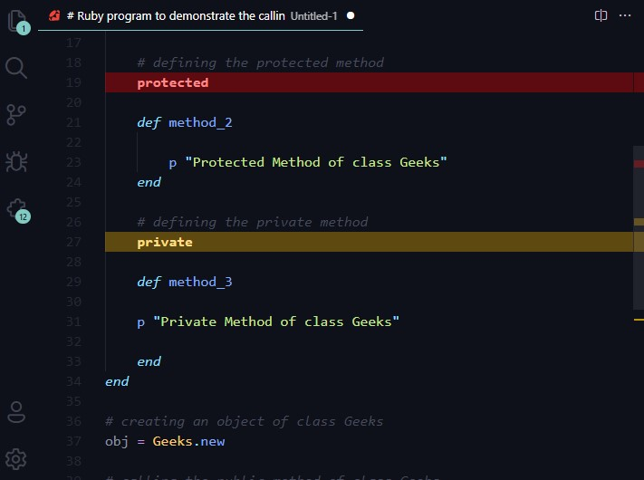
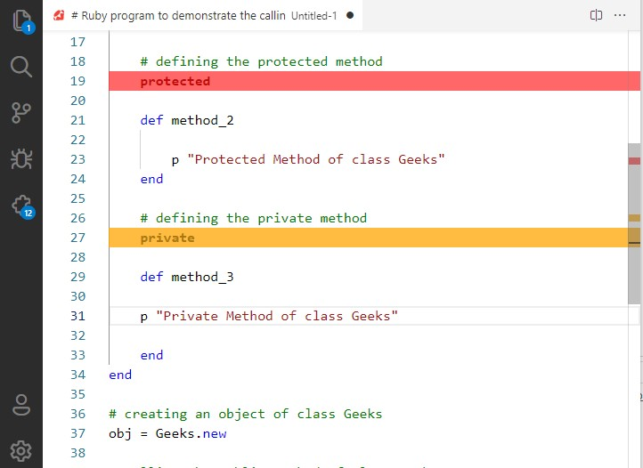

# 🌈colorized-access-modifier🌈

VS Code Extension to highlight access modifiers(excluding Public) of Ruby 💎 Language.

## 😎 Features

Highlight the Private and Protected access modifiers to easily find/identify them in the Code.

## ⚙ Extension Settings

You can change the Text and Background Colors for both `private` and `protected` modifiers using following settings:

- `colorized_access_modifier.privateBackground`: Background Color for Private
- `colorized_access_modifier.protectedBackground`: Background Color for Protected
- `colorized_access_modifier.privateText`: Text Color of Private
- `colorized_access_modifier.protectedText`: Text Color of Protected

## 😐 Known Issues

None yet, but do let me know if you find any.

## 📃 Release Notes

### 1.0.0

Initial release.

-----------------------------------------------------------------------------------------------------------
## Enjoy! 😃
